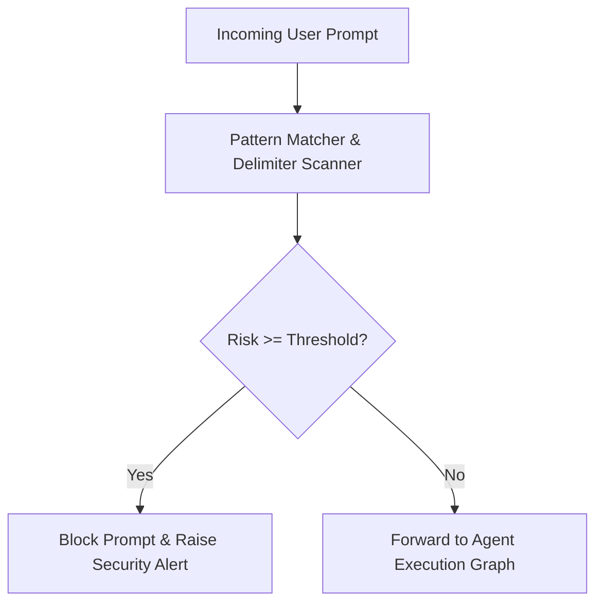

# genpark-prompt-injection-jailbreak-detector-skill

Heuristic and statistical prompt injection and jailbreak detector with semantic delimiter protection and adversarial pattern scoring.

Provided by **GenPark AI** (https://genpark.ai). Discover production agent guardrails on the **GenPark Model Context Protocol Directory** (https://genpark.ai/mcp).

## Features
- **Deterministic Pattern Guard**: Instantaneous microsecond evaluation before sending queries to LLMs.
- **Delimiter Tamper Protection**: Catches injected markdown and LLM prompt tokens.
- **Zero External Dependencies**: Pure Python standard library.
