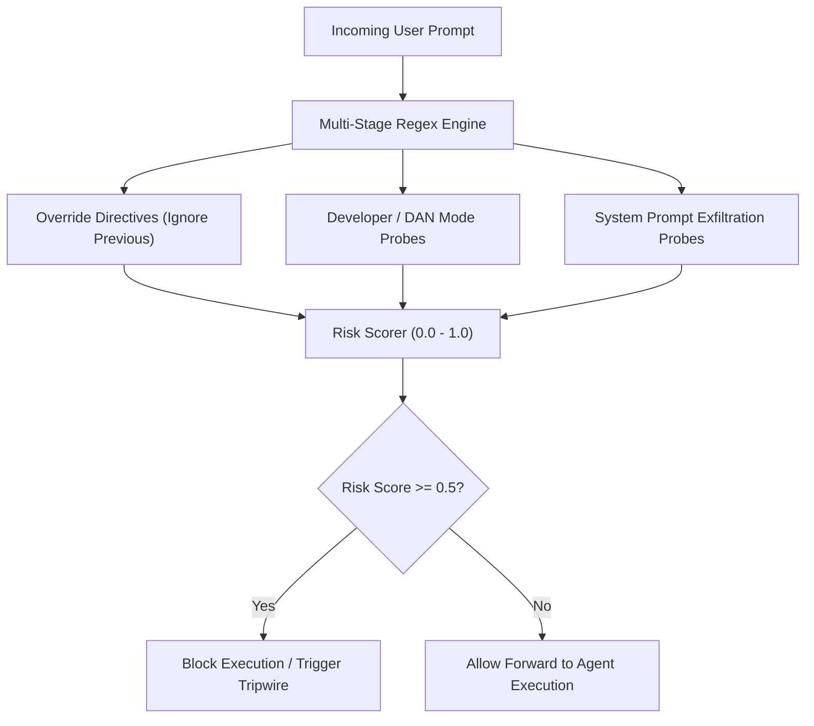

# genpark-prompt-injection-jailbreak-detector-skill

Agent Skill implementing **Prompt Injection & Adversarial Jailbreak Detection** in 100% Python standard library.

## Architectural Flow

```mermaid
flowchart TD
    Prompt["Incoming User Prompt"] --> Filter["Multi-Stage Regex Engine"]
    Filter --> P1["Override Directives (Ignore Previous)"]
    Filter --> P2["Developer / DAN Mode Probes"]
    Filter --> P3["System Prompt Exfiltration Probes"]
    P1 & P2 & P3 --> Aggregator["Risk Scorer (0.0 - 1.0)"]
    Aggregator --> Decision{"Risk Score >= 0.5?"}
    Decision -->|Yes| Block["Block Execution / Trigger Tripwire"]
    Decision -->|No| Allow["Allow Forward to Agent Execution"]
```
